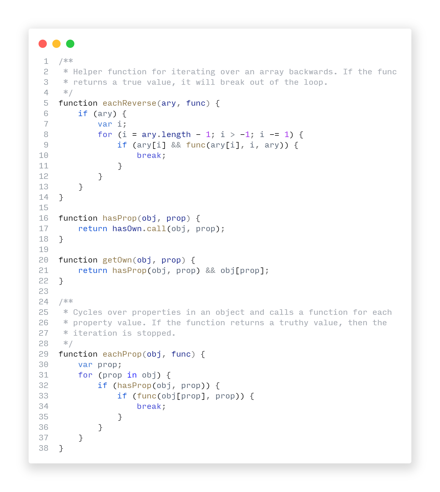
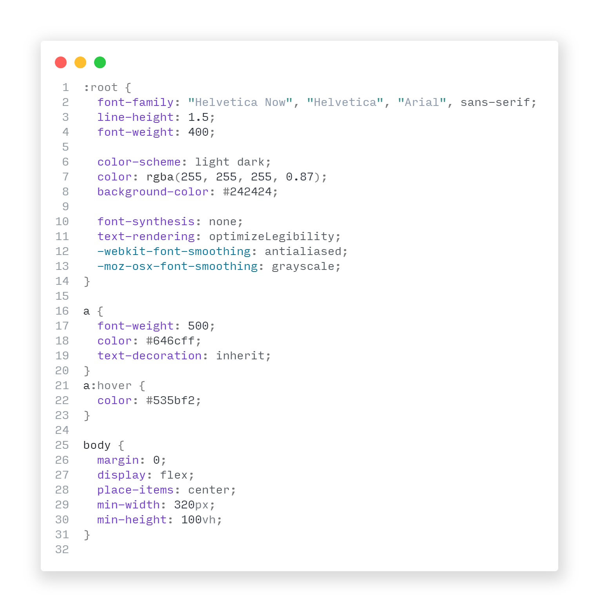
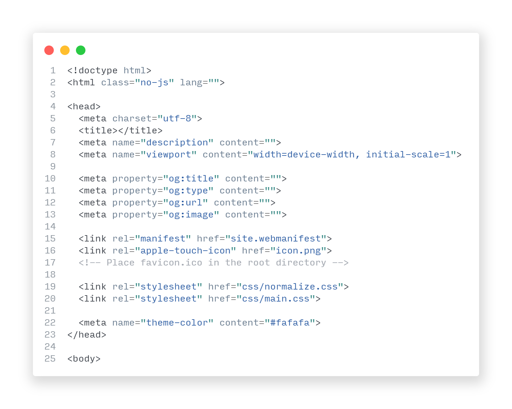
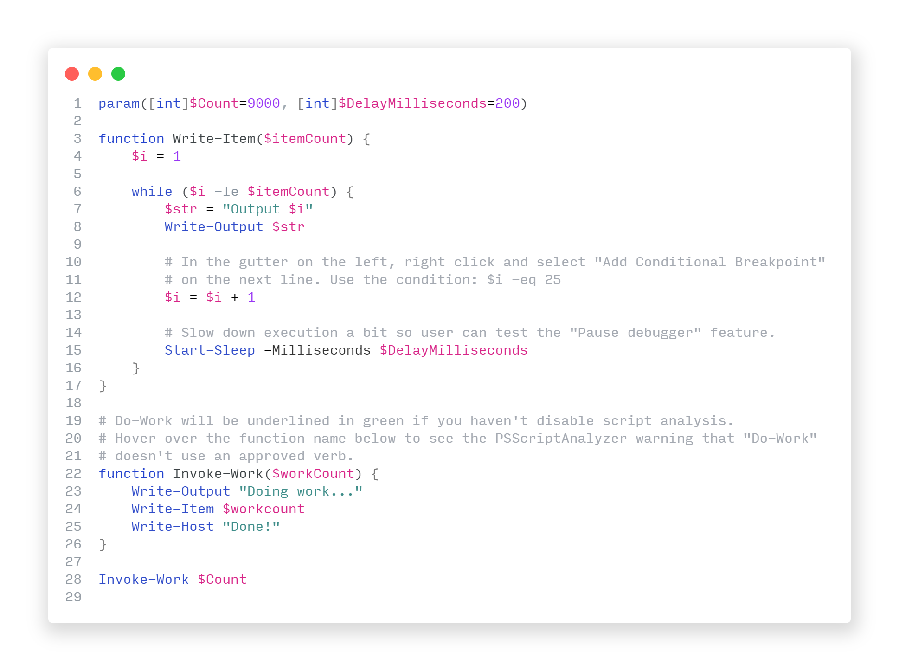
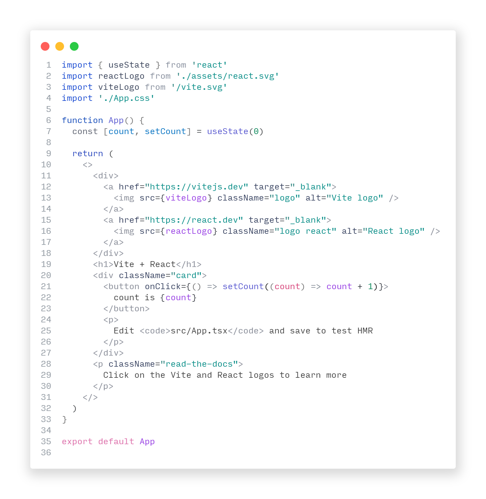

This is my own personal light VSCode theme with an extreme amount of fine-tuning with regards to language syntax highlighting and the VSCode UI. It's meant to be as un-obtrusive as possible so you can focus on coding.

### Installation from the Marketplace

[Click here for the marketplace link.](https://marketplace.visualstudio.com/items?itemName=futuremotion.futuremotion-light)

### Installation from within VSCode

1.  Install [Visual Studio Code](https://code.visualstudio.com/)
2.  Launch Visual Studio Code
3.  Choose **Extensions** from menu
4.  Search for `Futuremotion Light`
5.  Click **Install** to install it
6.  From the menu bar click: Code > Preferences > Color Theme > **Futuremotion Light**

### Installation From VSIX

- Download [fm-theme-futuremotion-light.vsix](https://github.com/futuremotiondev/fm-vscode-futuremotion-light/raw/main/build/fm-theme-futuremotion-light.vsix)
- Install it by following [these instructions](https://code.visualstudio.com/docs/editor/extension-gallery#_install-from-a-vsix)

### Javascript
---

### CSS
---

### HTML
---

### Powershell
---

### TypeScript+TypeScript React
---

